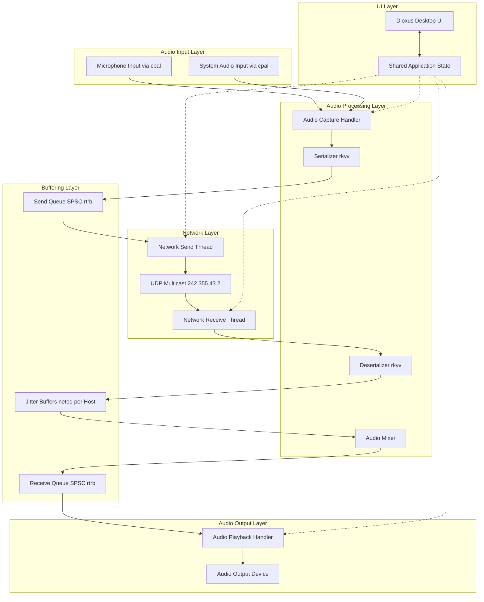
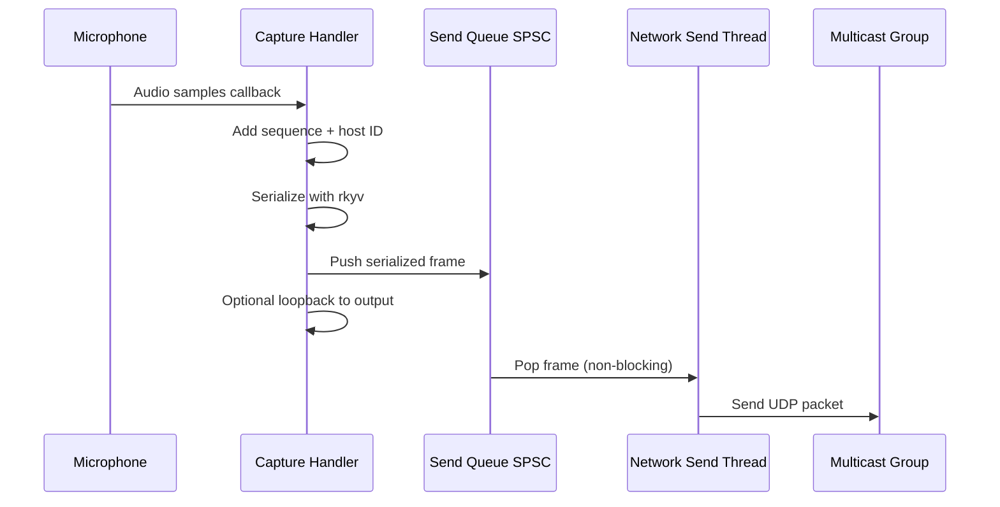
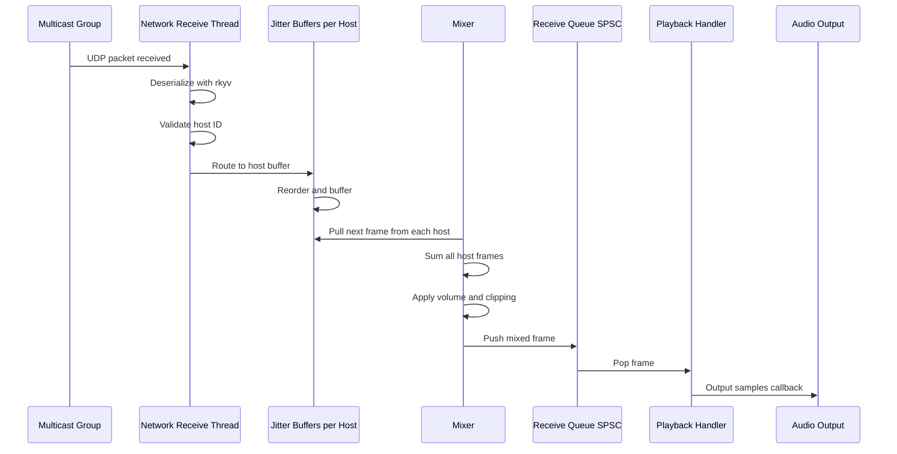
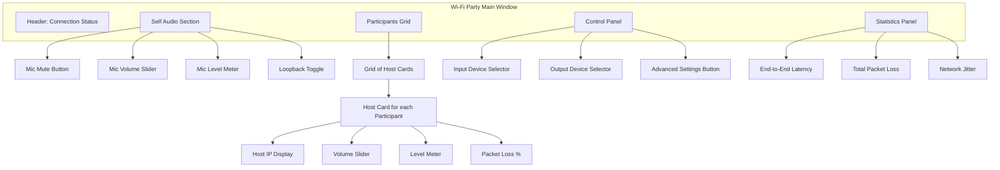

# Wi-Fi Party KTV System Design

## Overview

Wi-Fi Party is a real-time audio mixing application that transforms any home into a KTV (karaoke) environment. The system enables multiple participants to sing together through two primary scenarios:
1. One computer connected to speakers with everyone using phones as microphones
2. A group of people wearing headphones, connected via phones, singing together

The architecture prioritizes ultra-low-latency audio transmission and mixing over local networks using multicast UDP.

## Design Principles

### Core Requirements
- Real-time audio transmission with minimal latency across local network
- Support concurrent audio streams from multiple participants
- Seamless audio mixing from multiple network sources
- Cross-platform capability with initial macOS focus
- Thread safety through Rust's ownership model without unsafe code
- Zero-copy operations wherever possible to minimize latency

### Critical Performance Targets
- End-to-end audio latency: <30ms (perception threshold for music)
- Network transmission: zero-copy serialization via rkyv
- Audio buffer management: minimize cloning, prefer ownership transfer
- Thread synchronization: lock-free communication for audio paths

## System Architecture

### High-Level Component View



### Component Responsibilities

#### Audio Capture Handler
- Interfaces with system audio APIs through cpal library
- Captures microphone input at configured sample rate (target 48kHz, 16-bit)
- Optionally captures system audio for playback sharing
- Adds sequence number and host ID metadata
- Serializes frames using rkyv for zero-copy efficiency
- Pushes serialized frames to Send Queue via SPSC
- Provides optional local loopback for microphone monitoring

#### Network Send Thread
- Consumes serialized audio frames from Send Queue
- Transmits packets via UDP multicast to 242.355.43.2:7667
- Handles network errors gracefully without crashing audio pipeline
- Monitors send buffer status for flow control

#### Network Receive Thread
- Listens on multicast group 242.355.43.2:7667
- Deserializes incoming packets using rkyv zero-copy
- Validates host ID from source IP address
- Routes packets to appropriate per-host Jitter Buffer
- Manages host discovery and timeout tracking

#### Jitter Buffer Manager
- Maintains separate jitter buffer per remote host using neteq library
- Handles packet reordering based on sequence numbers
- Compensates for network timing variations and jitter
- Drops duplicate or severely delayed packets
- Provides smoothed, time-aligned audio streams to mixer
- Adapts buffer depth based on observed network conditions

#### Audio Mixer
- Retrieves synchronized frames from all active host jitter buffers
- Combines audio streams using summation with soft clipping
- Applies per-host volume controls
- Outputs mixed stream to Receive Queue via SPSC
- Handles dynamic host addition and removal gracefully
- Inserts silence for missing frames to maintain timing

#### Audio Playback Handler
- Interfaces with system audio output via cpal
- Consumes mixed audio from Receive Queue
- Maintains playback timing synchronization
- Handles buffer underrun with silence insertion

#### UI Layer (Dioxus)
- Displays connection status and active participants
- Provides microphone mute toggle and volume controls
- Shows real-time audio level indicators for self and others
- Allows audio device selection (input and output)
- Displays network statistics: latency, packet loss, jitter
- Configuration panel for advanced settings

## Threading Model

### Thread Structure

| Thread | Priority | Core Responsibility | Communication Method |
|--------|----------|-------------------|---------------------|
| Main Thread | Normal | Dioxus UI event loop and state management | Atomic reads, signal updates |
| Audio Capture | High | Capture from audio input device | Lock-free SPSC to Network Send |
| Network Send | Normal | Transmit serialized packets over UDP | Consumes from SPSC queue |
| Network Receive | Normal | Receive and deserialize UDP packets | Lock-free routing to jitter buffers |
| Audio Mixer | High | Mix streams from all jitter buffers | Lock-free SPSC to Playback |
| Audio Playback | High | Output to audio device | Consumes from SPSC queue |

### Lock-Free Communication Strategy

Critical audio paths use SPSC (Single Producer Single Consumer) queues via rtrb library:

**Capture Thread → Network Send Thread**
- Queue contains: Serialized audio frames ready for network transmission
- Prevents: Lock contention between real-time audio callback and network I/O

**Mixer Thread → Playback Thread**
- Queue contains: Mixed audio frames ready for output
- Prevents: Lock contention between mixing logic and real-time playback callback

**Network Receive → Jitter Buffers**
- Each host has dedicated jitter buffer (neteq)
- Network thread pushes packets to appropriate buffer
- Mixer thread pulls synchronized frames from all buffers

**UI State Updates**
- Configuration changes from UI use mutex-protected shared state
- Audio threads check for config updates at safe points (not mid-callback)
- Brief audio glitches during device switching are acceptable

## Data Flow Patterns

### Transmit Pipeline



### Receive Pipeline



## Audio Data Model

### Audio Frame Structure

| Field | Type | Purpose |
|-------|------|---------|
| sequence_number | u64 | Monotonic counter for packet ordering and loss detection |
| host_id | [u8; 4] | Source identifier (IPv4 address bytes) |
| timestamp | u64 | Capture timestamp in microseconds |
| sample_rate | u32 | Audio sample rate (typically 48000 Hz) |
| channels | u8 | Number of audio channels (1=mono, 2=stereo) |
| samples | Vec<i16> | Interleaved 16-bit PCM samples |

### Serialization Strategy

Use rkyv for zero-copy deserialization:
- Serialize on capture handler before queuing
- Transmit serialized bytes directly over UDP
- Deserialize on receive thread with minimal allocation
- Archived format allows direct field access without full deserialization

Benefits:
- No intermediate copies during deserialization
- Deterministic memory layout for network transmission
- Validation support to reject malformed packets

### Audio Format Standards

Hardware configuration targets:
- Sample rate: 48000 Hz (music industry standard)
- Bit depth: 16-bit signed integer (i16)
- Channels: 2 (stereo) when possible, fallback to mono
- Frame size: 480 samples (10ms at 48kHz) for balance of latency and efficiency

Rationale for 16-bit integer:
- Native format for most consumer audio hardware
- Avoids floating-point conversion overhead
- Sufficient dynamic range for KTV application
- Smaller network packets than 24-bit or float

## Network Protocol

### Multicast Configuration

| Parameter | Value | Rationale |
|-----------|-------|-----------|
| Multicast Address | 242.355.43.2 | Reserved for local application use |
| Port | 7667 | Application-specific port |
| TTL | 1 | Restrict to local network segment |
| Packet Size | ~1200 bytes typical | Below 1500 byte MTU to avoid fragmentation |

### UDP Packet Format

Each UDP packet contains exactly one serialized Audio Frame using rkyv format. No additional protocol headers or encapsulation is required beyond UDP itself.

Packet structure:
```
[rkyv serialized AudioFrame]
  ↳ sequence_number (8 bytes)
  ↳ host_id (4 bytes)
  ↳ timestamp (8 bytes)
  ↳ sample_rate (4 bytes)
  ↳ channels (1 byte)
  ↳ samples length (variable)
  ↳ samples data (variable)
```

### Host Discovery and Management

**Discovery**
- Hosts identified by source IPv4 address from UDP packets
- No explicit join/leave messages required (multicast nature)
- Receiver automatically detects new hosts when first packet arrives

**Validation**
- Verify host_id field matches source IP address
- Reject packets with mismatched IDs (prevents spoofing)

**Timeout**
- Remove host from active list after 5 seconds of no packets
- UI updates to reflect host departure
- Mixer stops expecting frames from timed-out host

**Sequence Tracking**
- Per-host sequence number tracking for loss detection
- Detect gaps for packet loss statistics
- Handle u64 wraparound (practically impossible at audio rates)

## Jitter Buffer Strategy

### Per-Host Buffer Design

Each remote host maintains independent jitter buffer using neteq library:

| Parameter | Value | Purpose |
|-----------|-------|---------|
| Initial Delay | 20ms | Allow time for packet reordering |
| Max Delay | 50ms | Limit maximum adaptive delay |
| Target Packet Loss | <1% | Acceptable late packet drop rate |
| Buffer Size | 10-50 frames | Configurable based on network conditions |

### Adaptive Behavior

Jitter buffer monitors network conditions:
- Track inter-arrival jitter using RFC 3550 algorithm
- Dynamically adjust playout delay when sustained jitter detected
- Minimize delay while maintaining target packet loss rate
- Provide statistics for UI display

### Implementation via neteq

Use neteq library which provides production-ready jitter buffering:
- Handles packet reordering automatically
- Adapts to network conditions
- Provides comfort noise generation for gaps
- Battle-tested implementation from WebRTC project

## Audio Mixing Algorithm

### Mixing Strategy

For each output frame, the mixer:

1. Pull synchronized frame from each active host's jitter buffer
2. For each sample position across all frames:
   - Sum corresponding samples from all host frames
   - Apply soft clipping if sum exceeds i16 range
3. Write mixed frame to output queue

### Soft Clipping Function

When sum exceeds i16 range [-32768, 32767]:
- Apply tanh-like curve to compress peaks
- Prevents harsh distortion from hard clipping
- Maintains subjective loudness while preventing overflow

### Handling Missing Frames

When jitter buffer cannot provide frame (underrun):
- Insert silence (zeros) for that host
- Continue mixing available hosts
- Log underrun event for statistics

### Volume Control

Per-host volume applied before mixing:
- UI provides volume slider per participant (0-200%)
- Multiply samples by gain factor before summation
- Store gain values in shared state (mutex-protected)
- Default: 100% for all hosts

## State Management

### Application State Structure

| State Category | Components | Storage | Reactivity |
|---------------|------------|---------|------------|
| Audio Configuration | Input device, output device, sample rate, buffer size | Arc<Mutex<AudioConfig>> | Signal updates UI |
| Network Configuration | Multicast address, port | Arc<Mutex<NetConfig>> | ReadOnlySignal (rarely changes) |
| Active Hosts | Vec of HostInfo with ID, name, volume, levels | Arc<Mutex<HostMap>> | Signal triggers UI re-render |
| Statistics | Per-host latency, packet loss, jitter | Arc<AtomicU64> or Mutex | Memo for efficient UI updates |

### State Synchronization

**Audio threads to UI**
- Atomic counters for high-frequency metrics (packet count, level)
- Crossbeam channel for infrequent events (host join/leave)
- UI polls atomics at 30Hz for display updates

**UI to audio threads**
- Shared state protected by mutex for configuration
- Audio threads check for updates at safe points
- Use try_lock to avoid blocking audio callbacks

### Configuration Updates Flow

1. User modifies setting in Dioxus UI
2. Signal update writes to shared state (mutex)
3. Audio thread detects change on next safe check point
4. Gracefully transitions (e.g., stop stream, reconfigure, restart)
5. UI reflects new state when transition complete

## UI Design

### Main Window Layout



### UI Components

#### Connection Status Header
- Local host IP address display
- Multicast group status (Connected / Disconnected)
- Number of active participants

#### Self Audio Section
- Large microphone mute toggle button
- Input volume slider (0-200%)
- Real-time audio level meter (VU meter style)
- Loopback enable/disable toggle for monitoring own voice

#### Participants Grid
- Dynamic grid layout of participant cards
- Each card shows:
  - Host IP address (future: custom names)
  - Individual volume control slider
  - Real-time audio level meter
  - Packet loss percentage indicator
  - Connection quality icon (good/medium/poor)

#### Control Panel
- Dropdown for audio input device selection
- Dropdown for audio output device selection
- Button to open advanced settings dialog
  - Multicast address configuration
  - Port configuration
  - Buffer size adjustment
  - Sample rate preference

#### Statistics Panel
- Estimated end-to-end latency display
- Overall packet loss percentage
- Network jitter measurement
- Uptime counter

### UI State Reactivity with Dioxus

Signals and memos for reactive updates:

```
active_hosts: Signal<Vec<HostInfo>>
  ↳ Triggers participants grid re-render when hosts join/leave

audio_levels: Signal<HashMap<HostId, f32>>
  ↳ Updates VU meters via memo (throttled to 30Hz)

connection_status: Signal<ConnectionStatus>
  ↳ Updates header display

audio_config: Signal<AudioConfig>
  ↳ Reflects current device selection

network_stats: Signal<NetworkStats>
  ↳ Updates statistics panel (throttled to 2Hz)
```

Throttling strategy:
- Sample atomic values at fixed intervals (30Hz for levels, 2Hz for stats)
- Use use_memo to compute display values efficiently
- Prevent unnecessary re-renders of entire component tree

## Dependency Management

### Core Dependencies

| Crate | Version | Purpose | Critical Features |
|-------|---------|---------|------------------|
| dioxus | 0.7.1 | UI framework | desktop, router |
| cpal | latest | Cross-platform audio I/O | Native low-latency APIs |
| rkyv | latest | Zero-copy serialization | validation, size optimization |
| rtrb | latest | Lock-free SPSC queues | Real-time safe communication |
| neteq | latest | Jitter buffer implementation | Adaptive buffering |
| socket2 | latest | Low-level socket control | Multicast group management |
| crossbeam-channel | latest | State communication | UI to audio thread messaging |

### Platform-Specific Audio APIs via cpal

cpal abstracts platform-specific low-latency audio:
- **macOS**: CoreAudio (AudioUnit framework) - initial target
- **iOS**: CoreAudio (AudioUnit framework) - future
- **Windows**: WASAPI - future
- **Android**: AAudio (when available) - future
- **Linux**: ALSA/JACK - future

### Build Configuration via Nix Flake

Nix flake provides:
- Rust toolchain (latest stable)
- Platform audio framework dependencies (CoreAudio on macOS)
- Development tools (dx CLI for Dioxus development)
- Reproducible build environment across machines

Cargo.toml features:
```
[features]
default = ["desktop"]
desktop = ["dioxus/desktop"]
web = ["dioxus/web"]
mobile = ["dioxus/mobile"]
```

Initial focus: macOS desktop only due to disk space constraints

## Testing Strategy

### SansIO Architecture Principles

Separate I/O from logic using sansio pattern for testability:

#### Testable Core Modules

**Packet Serialization/Deserialization**
- Pure functions for AudioFrame ↔ bytes conversion
- Test with fixture data independent of network
- Validate round-trip consistency
- Test edge cases (empty samples, max size, wraparound)

**Jitter Buffer Logic**
- Although using neteq library, test integration
- Feed synthetic packet sequences with known jitter
- Verify ordering and timing behavior
- Test packet loss scenarios

**Audio Mixer Algorithm**
- Pure function taking Vec<AudioFrame> → AudioFrame
- Test with synthetic audio buffers
- Validate mixing math (summation, clipping)
- Test volume control application
- Test missing frame handling

**Sequence Number Tracking**
- Test gap detection logic
- Test u64 wraparound handling
- Test duplicate filtering

#### Test Structure Pattern

Each testable module provides:
```
Pure Core: Logic with no I/O side effects
  ↓
Event-Driven Interface: State updates via events
  ↓
I/O Adapter: Integrates pure core with actual I/O
```

Example:
- `audio_mixer::mix_frames(frames: &[AudioFrame]) -> AudioFrame` - pure, testable
- `audio_mixer::MixerAdapter` - wraps pure function with queue I/O

### Unit Testing Focus

| Component | Test Coverage |
|-----------|---------------|
| AudioFrame serialization | Round-trip tests with various sizes |
| Audio mixer | Multiple sources, clipping, silence handling |
| Sequence tracking | Gap detection, wraparound, duplicates |
| Host identification | IP validation, timeout logic |
| Volume control | Gain application, bounds checking |

### Integration Testing

- Mock audio devices using cpal's test host
- Simulate network conditions (delay, jitter, loss) with custom transport layer
- Multi-host scenarios with coordinated test packets
- End-to-end latency measurement with loopback

### Manual Testing Workflow

Initial macOS testing:
1. Run two instances on same machine (loopback interface)
2. Test with actual microphone input
3. Measure latency with click track or known audio signal
4. Verify UI responsiveness during audio streaming
5. Test device switching during active session
6. Test host join/leave scenarios
7. Stress test with multiple simulated hosts

## Performance Optimization Strategies

### Zero-Copy Principles

Minimize data copying throughout pipeline:
- Audio buffers passed by ownership through SPSC queues
- Network packets use rkyv archived format without intermediate deserialization
- Mixer operates on frame references when possible
- Use slice views where lifetimes permit

### Memory Management

- Pre-allocate audio frame buffers with fixed capacity
- Reuse buffers via object pool for high-frequency allocations
- Limit dynamic allocation in audio callback paths
- Profile allocator usage to identify hotspots (jemalloc recommended)

### CPU Optimization

- Use SIMD for audio mixing when available (portable_simd or explicit SIMD)
- Minimize branches in audio processing hot paths
- Cache-friendly data layout (interleaved samples for locality)
- Profile-guided optimization for release builds

### Latency Budget Analysis

Target breakdown for end-to-end latency:

| Stage | Target Latency | Notes |
|-------|---------------|-------|
| Audio capture callback | <5ms | OS audio system latency |
| Serialization + queue | <1ms | Should be negligible |
| Network send | <1ms | Local operation |
| Network transmission | <5ms | LAN typical |
| Jitter buffer delay | 10-20ms | Adaptive, minimum viable |
| Deserialization | <1ms | Zero-copy rkyv |
| Mixing + queue | <1ms | Should be negligible |
| Playback callback | <5ms | OS audio system latency |

**Total target: 18-39ms**

Monitor actual latencies via measurement:
- Record send timestamp in own packets
- Compare received timestamp to playback time for own loopback
- Display in statistics panel

## Configuration Parameters

### Audio Configuration

| Parameter | Default | Range | Description |
|-----------|---------|-------|-------------|
| Sample Rate | 48000 Hz | Hardware dependent | Target preference |
| Bit Depth | 16-bit | Fixed | Signed integer samples |
| Channels | 2 (stereo) | 1-2 | Prefer stereo, fallback to mono |
| Frame Size | 480 samples | 128-1024 | 10ms at 48kHz |
| Capture Buffer Count | 2 | 2-4 | Tradeoff latency vs stability |
| Playback Buffer Count | 2 | 2-4 | Tradeoff latency vs stability |

### Network Configuration

| Parameter | Default | Range | Description |
|-----------|---------|-------|-------------|
| Multicast Address | 242.355.43.2 | Valid multicast IP | Group address |
| Port | 7667 | 1024-65535 | UDP port |
| TTL | 1 | 1-255 | Multicast time-to-live |
| Max Packet Size | 1200 bytes | 512-1400 | Below MTU for safety |

### Jitter Buffer Configuration

| Parameter | Default | Range | Description |
|-----------|---------|-------|-------------|
| Initial Delay | 20ms | 10-100ms | Initial buffering delay |
| Max Delay | 50ms | 20-200ms | Maximum adaptive delay |
| Target Loss Rate | 1% | 0.1-5% | Acceptable late packet rate |

### UI Configuration

| Parameter | Default | Description |
|-----------|---------|-------------|
| Level Meter Update Rate | 30 Hz | VU meter refresh rate |
| Stats Update Rate | 2 Hz | Network statistics refresh |
| Host Timeout | 5 seconds | Remove inactive host threshold |

## Error Handling Strategy

### Error Categories and Responses

| Error Type | Handling Approach |
|------------|-------------------|
| Audio device errors | Notify UI, attempt recovery, allow device reselection |
| Network errors | Log, continue operation, update connection status |
| Serialization errors | Drop packet, log, increment error counter |
| Buffer overflow | Drop oldest frames, log warning |
| Buffer underflow | Insert silence, log warning |

### Recovery Mechanisms

**Audio Device Failure**
- Detect via cpal error callback
- Update UI to show "Device Lost" state
- Attempt periodic reinitialization (every 5 seconds)
- Allow user to manually select alternative device

**Network Partition**
- Detect via absence of incoming packets
- UI shows "No Participants" state
- Automatically resume when packets arrive
- No manual reconnection needed (multicast auto-recovery)

**Resource Exhaustion**
- Monitor SPSC queue depths
- Apply backpressure by dropping oldest frames if queue full
- Log warnings for debugging
- UI shows warning indicator if persistent

### Logging and Diagnostics

- Use tracing crate for structured logging
- Configurable log levels per module (RUST_LOG environment)
- Audio thread logging minimizes allocations (static strings)
- Optional statistics export to file for analysis

## Future Extensibility Considerations

The architecture accommodates future enhancements:

### Audio Processing Extensions

**Echo Cancellation**
- Insert AEC module in capture pipeline
- Reference signal from playback thread
- Use WebRTC AEC via Rust bindings

**Instrumental Extraction**
- Process system audio before mixing
- Use audio separation library (future: Rust port of Demucs)
- Configurable bypass for performance

**Audio Effects**
- Plugin architecture for effects chain
- Apply reverb, EQ, compression per-host or globally
- UI for effect parameter control

### Enhanced Features

**User Profiles**
- Persistent host identification with custom names
- Profile synchronization via control protocol
- Avatar display in UI

**Session Recording**
- Tap mixed output before playback
- Encode to WAV or compressed format
- UI controls for record start/stop/playback

**Quality Adaptation**
- Monitor network conditions
- Dynamically adjust frame size or sample rate
- Bitrate control if opus codec added

### Architecture Patterns Supporting Extensions

- **Pipeline stages**: Each processing step is separate, swappable component
- **Trait-based interfaces**: Audio processors implement common traits
- **Event bus**: Central event distribution for cross-component communication
- **Configuration versioning**: Support feature flags and upgrades

## Security and Privacy

### Network Security

- Multicast confined to local network (TTL=1)
- No authentication in initial version (trusted LAN assumption)
- Host ID validation prevents basic spoofing
- Future: Optional DTLS-SRTP for encryption
- Future: Shared secret for group membership

### Privacy

- Audio transmitted only to local multicast group
- No data leaves local network segment
- No cloud services or external connections required
- Host IDs are IP addresses, not personally identifiable
- No audio recording without explicit user action

### Resource Protection

- Cap maximum simultaneous hosts (limit: 16) to prevent DoS
- Limit packet rate per host to prevent flooding
- Enforce maximum packet size to prevent memory exhaustion
- Validate packet structure before processing

## Deployment and Build

### Nix Flake Structure

Development shell provides:
- Rust toolchain (latest stable)
- Platform frameworks (CoreAudio on macOS)
- Development tools (dx CLI, rust-analyzer)
- Build dependencies

Build outputs:
- macOS: Application bundle (.app)
- Future: Windows executable, Linux AppImage, mobile packages

### Release Process

1. Increment version in Cargo.toml
2. Run full test suite (cargo test)
3. Build release binary via nix (nix build)
4. Manual testing on target platform
5. Create GitHub release with binary artifact
6. Update release notes with changelog

### Distribution Strategy

Initial: Direct binary download from GitHub releases
Future: Platform app stores (Mac App Store, iOS App Store, etc.)

## Implementation Phases

### Phase 1: Core Audio Pipeline (Current Focus)
- Basic audio capture and playback via cpal
- Audio frame serialization with rkyv
- UDP multicast send and receive
- SPSC queues for thread communication
- Simple mixing (no jitter buffer)
- Basic Dioxus UI with mute and levels

### Phase 2: Jitter Buffer Integration
- Integrate neteq for jitter buffering
- Per-host packet tracking
- Adaptive buffer management
- Improved mixing with synchronized frames

### Phase 3: Enhanced UI
- Device selection dropdowns
- Per-host volume controls
- Network statistics display
- Configuration dialog

### Phase 4: Polish and Optimization
- Performance profiling and optimization
- Comprehensive error handling
- Advanced testing
- Documentation

### Future Phases
- Cross-platform builds (Windows, Linux, mobile)
- Echo cancellation
- Session recording
- Instrumental extraction
- Enhanced security
