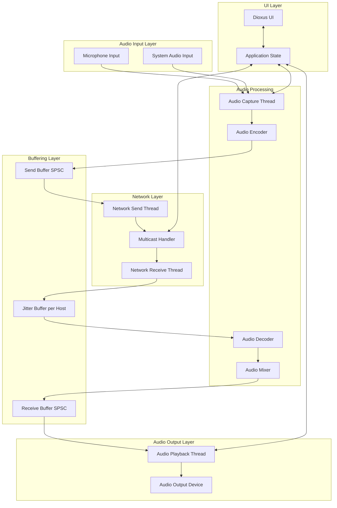
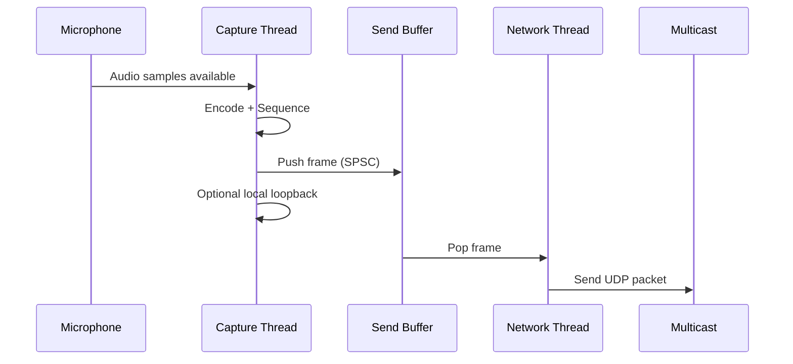
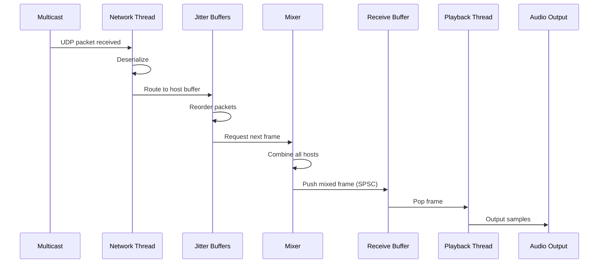
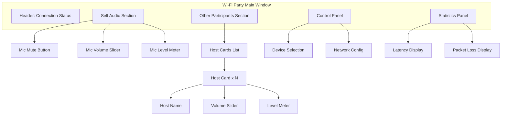

# Wi-Fi Party KTV System Design

## Overview

Wi-Fi Party is a real-time audio mixing application that transforms any home into a KTV (karaoke) environment. The system enables multiple participants to sing together through two primary scenarios: shared speaker setup or individual headphone sessions. The architecture prioritizes low-latency audio transmission and mixing over local networks.

## Design Goals

### Primary Objectives
- Enable real-time audio transmission with minimal latency across local network
- Support concurrent audio streams from multiple participants
- Provide seamless audio mixing from network sources
- Deliver cross-platform capability with initial macOS focus
- Maintain thread safety through Rust's ownership model without unsafe code

### Performance Targets
- End-to-end audio latency: minimize to perception threshold
- Network transmission: use zero-copy serialization where possible
- Audio buffer management: minimize cloning operations
- Thread synchronization: optimize lock contention

## System Architecture

### High-Level Component View

### Component Responsibilities

#### Audio Capture Thread
- Interfaces with system audio APIs through cpal
- Captures microphone input at configured sample rate
- Optionally captures system audio for playback sharing
- Pushes captured audio frames to Send Buffer via SPSC queue
- Provides local loopback for microphone monitoring

#### Audio Encoder
- Prepares audio frames for network transmission
- Adds sequence numbers and host ID metadata
- In PCM mode: packages raw 16-bit samples directly
- In Opus mode: encodes with minimum latency settings (2.5-5ms frames, complexity 0)
- Serializes using rkyv for zero-copy efficiency
- Operates inline with capture thread to minimize latency

#### Network Send Thread
- Consumes audio frames from Send Buffer
- Transmits serialized packets via UDP multicast to 242.355.43.2
- Handles network error conditions gracefully

#### Network Receive Thread
- Listens on multicast group 242.355.43.2
- Deserializes incoming packets using rkyv
- Routes packets to appropriate per-host Jitter Buffer
- Manages host discovery and tracking

#### Jitter Buffer Manager
- Maintains separate jitter buffer per remote host
- Handles packet reordering based on sequence numbers
- Compensates for network timing variations
- Drops duplicate or severely delayed packets
- Provides smoothed audio stream to mixer

#### Audio Mixer
- Combines audio streams from all active hosts
- Applies volume normalization to prevent clipping
- Outputs mixed stream to Receive Buffer via SPSC queue
- Handles dynamic host addition and removal

#### Audio Playback Thread
- Interfaces with system audio output via cpal
- Consumes mixed audio from Receive Buffer
- Maintains playback timing synchronization
- Handles buffer underrun conditions

#### UI Layer (Dioxus)
- Displays connection status and active participants
- Provides controls for microphone muting and volume
- Shows audio level indicators for self and others
- Allows configuration of audio device selection
- Displays network statistics (latency, packet loss)

## Data Flow Patterns

### Transmit Pipeline

### Receive Pipeline

## Threading Model

### Thread Structure

| Thread | Priority | Responsibilities | Synchronization |
|--------|----------|-----------------|----------------|
| Main Thread | Normal | UI event handling, state management | Signal-based communication with audio threads |
| Audio Capture | High | Capture from audio input device | Lock-free SPSC queue to Network Send |
| Network Send | Normal | Transmit encoded packets | Consumes from SPSC queue |
| Network Receive | Normal | Receive and deserialize packets | Lock-free routing to jitter buffers |
| Audio Mixer | High | Mix streams from jitter buffers | Lock-free SPSC queue to Playback |
| Audio Playback | High | Output to audio device | Consumes from SPSC queue |

### Lock-Free Communication Strategy

All audio-critical paths use SPSC (Single Producer Single Consumer) queues via rtrb library to avoid lock contention:

- Capture Thread → Network Send Thread: Audio frames queue
- Mixer Thread → Playback Thread: Mixed audio queue
- Network Receive Thread → Mixer: Per-host jitter buffers act as intermediary

Configuration changes from UI thread use simple mutex-protected shared state. Audio glitches during configuration changes (device switching, mute toggling) are acceptable trade-offs for implementation simplicity.

## Audio Data Model

### Audio Frame Structure

| Field | Type | Purpose |
|-------|------|---------|
| sequence_number | u64 | Packet ordering and loss detection |
| host_id | [u8; 4] | Source identifier (IPv4 address) |
| codec | u8 | 0=PCM, 1=Opus |
| sample_rate | u32 | Audio sample rate (typically 48000) |
| channels | Vec<Vec<i16>> | Per-channel sample data, outer vec is channels |

### Serialization Strategy

Use rkyv for zero-copy deserialization:
- Serialize on capture thread before queuing
- Transmit serialized bytes directly
- Deserialize on receive thread with minimal allocation
- Archived format allows direct access without full deserialization

### Audio Encoding

Two modes supported:

**PCM Mode (Unencoded)**
- Direct transmission of 16-bit PCM samples
- Zero encoding latency
- Higher bandwidth consumption
- Suitable for high-quality local networks
- Channel data stored directly in channels field

**Opus Mode (Encoded)**
- Use Opus codec for compression
- Configure for minimum latency:
  - Frame size: 2.5ms or 5ms
  - Complexity: 0 (fastest)
  - Bitrate: VBR with appropriate target for music
  - FEC: disabled (adds latency)
- Channels field contains encoded Opus packets (one per channel or stereo pair)
- Significantly reduced bandwidth

### Audio Format Standards

Hardware configuration request:
- Sample rate: 48000 Hz
- Bit depth: 16-bit signed integer
- Channels: 2 (stereo) when possible
- Fall back to mono or different rates if hardware doesn't support

Internal processing maintains 16-bit integer format to avoid floating-point conversion overhead in critical path.

## Network Protocol

### Multicast Configuration

| Parameter | Value | Rationale |
|-----------|-------|-----------|
| Multicast Address | 242.355.43.2 | Reserved for local applications |
| Port | 7667 | Application-specific |
| TTL | 1 | Restrict to local network |
| Packet Size | Configurable, default 1280 bytes | Below MTU to avoid fragmentation |

### Packet Format

Each UDP packet contains a single serialized Audio Frame using rkyv format. No additional protocol headers are required as UDP provides basic framing.

### Host Discovery

- Hosts identified by source IPv4 address from UDP packets
- Receiver tracks active hosts based on recent packet activity
- Host timeout: 5 seconds of no packets results in removal from mixer
- No explicit handshake required due to multicast nature
- Host ID field in packet must match source IP address for validation

## Jitter Buffer Strategy

### Per-Host Buffer Design

Each remote host maintains independent jitter buffer with following characteristics:

| Parameter | Value | Purpose |
|-----------|-------|---------|
| Buffer Size | 10-50 frames | Configurable based on network conditions |
| Initial Delay | 20ms | Allow packet reordering time |
| Playout Delay | Adaptive | Adjust based on jitter measurements |
| Late Packet Handling | Drop | Maintain real-time performance |

### Adaptive Behavior

The jitter buffer monitors packet arrival patterns:
- Track inter-arrival jitter using RFC 3550 algorithm
- Adjust playout delay when sustained jitter change detected
- Minimize delay while maintaining acceptable packet loss rate
- Target: <1% packet loss from late arrivals

### Implementation Approach

Use neteq library which provides production-ready jitter buffering with the necessary adaptive algorithms.

## Audio Mixing Algorithm

### Mixing Strategy

The mixer combines frames from all active hosts:

1. Retrieve synchronized frame from each jitter buffer
2. For each sample position across all frames:
   - Sum corresponding samples from all sources
   - Apply soft clipping if sum exceeds [-1.0, 1.0] range
3. Optional: Apply automatic gain control to normalize output level

### Handling Missing Frames

When jitter buffer cannot provide frame (buffer underrun):
- Use comfort noise or silence for missing host
- Continue mixing available hosts
- Log underrun events for statistics

### Volume Control

Individual host volume controls affect mixing:
- Apply gain before summation
- Store per-host volume in shared state
- UI provides sliders for each active participant

## State Management

### Application State Structure

| State Category | Components | Reactivity Needs |
|---------------|-----------|------------------|
| Audio Configuration | Input device, output device, sample rate, buffer size | Signal for device changes |
| Network Configuration | Multicast address, port, host ID | ReadOnlySignal (rarely changes) |
| Active Hosts | List of host IDs with metadata | Signal for UI updates |
| Audio Levels | Per-host VU meter data | Memo for efficient updates |
| Statistics | Latency, packet loss, jitter | Signal for periodic UI refresh |

### State Synchronization

Audio threads communicate state changes to UI thread via:
- Crossbeam channels for infrequent updates (host join/leave)
- Atomic values for high-frequency metrics (audio levels)
- Main thread polls atomics on render cycle for display

### Configuration Updates

UI changes to audio configuration:
1. User modifies setting in UI
2. Signal update triggers configuration change
3. Audio thread observes change on next callback
4. Gracefully transitions (e.g., fade out, reinitialize, fade in)

## UI Design

### Main View Layout

### UI Components

#### Connection Status Header
- Displays local host ID
- Shows multicast group status (connected/disconnected)
- Indicates number of active participants

#### Self Audio Section
- Microphone mute toggle
- Input volume control
- Real-time audio level indicator
- Loopback enable/disable toggle

#### Participants Section
- Dynamic list of active remote hosts
- Each participant card shows:
  - Host identifier or custom name
  - Individual volume control
  - Audio level visualization
  - Connection quality indicator

#### Control Panel
- Audio input device selector (dropdown)
- Audio output device selector (dropdown)
- Sample rate configuration
- Buffer size adjustment
- Advanced settings (multicast address, port)

#### Statistics Panel
- Estimated end-to-end latency
- Per-host packet loss percentage
- Network jitter measurements
- Optional packet count metrics

### UI State Reactivity

Dioxus signals track:
- `active_hosts: Signal<Vec<HostInfo>>` - triggers participant list re-render
- `audio_levels: Signal<HashMap<HostId, f32>>` - updates VU meters via memo
- `connection_status: Signal<ConnectionStatus>` - updates header display
- `config: Signal<AudioConfig>` - reflects current audio settings

High-frequency updates (audio levels) use throttling:
- Sample atomic values at 30Hz for UI updates
- Use `use_memo` to compute display values efficiently
- Prevent unnecessary re-renders of entire component tree

## Dependency Management

### Core Dependencies

| Crate | Purpose | Features |
|-------|---------|----------|
| dioxus | UI framework | desktop, router |
| cpal | Cross-platform audio I/O | - |
| rkyv | Zero-copy serialization | validation |
| rtrb | Lock-free SPSC queues | - |
| neteq | Jitter buffer implementation | - |
| socket2 | Low-level socket control for multicast | - |
| opus | Opus audio codec | - |
| crossbeam-channel | State communication | - |

### Platform-Specific Audio

cpal abstracts platform audio APIs:
- macOS: CoreAudio (AudioUnit framework)
- Windows: WASAPI
- Linux: ALSA/PulseAudio/JACK
- iOS: CoreAudio
- Android: AAudio (when available)

### Build Configuration

Cargo.toml features for platform targeting:
- Default: desktop (macOS initially)
- Future: web, mobile features as needed

Nix flake provides:
- Development environment with required system libraries
- Build dependencies for cpal (CoreAudio frameworks on macOS)
- Reproducible builds across environments

## Testing Strategy

### SansIO Architecture

Separate I/O from logic using sansio pattern:

#### Testable Core Modules
- **Packet Serialization/Deserialization**: Test with fixture data independent of network
- **Jitter Buffer Logic**: Feed test packet sequences, verify ordering and timing
- **Audio Mixer Algorithm**: Provide sample audio buffers, validate mixing math
- **Sequence Number Handling**: Test wraparound, gap detection, duplicate filtering

#### Test Structure
Each core module provides:
- Pure functions for logic (no I/O side effects)
- Event-driven interface for state updates
- Separate I/O adapter that uses the pure core

Example separation:
- `jitter_buffer::JitterBuffer` struct: pure logic, testable
- `jitter_buffer::JitterBufferAdapter`: integrates with actual network receive thread

### Unit Testing Focus

| Component | Test Coverage |
|-----------|---------------|
| Audio Frame serialization | Round-trip tests with various sample sizes, both PCM and Opus modes |
| Opus encoding/decoding | Validate codec initialization with low-latency config |
| Audio mixer | Multiple source mixing, clipping behavior, silence handling |
| Sequence tracking | Gap detection, wraparound at u64::MAX |
| Host identification | IP address extraction and validation |

Note: Logic implemented by external libraries (neteq jitter buffer) does not require testing—trust library implementation and focus on integration testing.

### Integration Testing

- Mock audio devices using cpal's test utilities
- Simulate network conditions (delay, jitter, loss)
- Multi-host scenarios with coordinated test packets
- End-to-end latency measurement

### Manual Testing

Initial macOS testing workflow:
1. Run multiple instances on same machine (loopback)
2. Test with actual microphone input
3. Measure latency with known audio signal (click track)
4. Verify UI responsiveness during audio streaming
5. Test device switching during active session

## Future Extensibility Considerations

The architecture should accommodate future enhancements without major restructuring:

### Audio Processing Extensions

**Instrumental Extraction**
- Insert processing stage between system audio capture and encoder
- Use audio separation library (e.g., spleeter-rust when available)
- Configurable bypass for performance

**Echo Cancellation**
- Add echo cancellation module in capture pipeline
- Reference signal from playback thread to capture thread
- Use WebRTC AEC implementation via rust bindings

**Audio Effects**
- Design mixer to support plugin architecture
- Apply effects (reverb, EQ) per-host or globally
- UI for effect parameter control

### Enhanced Features

**User Profiles**
- Persistent host identification with custom names
- Profile synchronization via supplementary protocol
- Avatar/icon support in UI

**Session Recording**
- Tap mixed audio output before playback
- Encode to audio file format
- UI controls for record start/stop

**Quality Adaptation**
- Monitor network conditions in receiver
- Signal back to senders for bitrate adjustment
- Dynamically adjust sample rate or compression

### Architecture Patterns for Extensibility

- **Pipeline stages**: Each audio processing step is separate, swappable component
- **Event bus**: Central event distribution for cross-component communication
- **Plugin interface**: Define traits for audio processors, mixers can chain them
- **Configuration schema**: Versioned configuration to support feature flags

## Error Handling Strategy

### Error Categories

| Error Type | Handling Approach |
|------------|-------------------|
| Audio device errors | Graceful fallback, notify UI, attempt recovery |
| Network errors | Log, continue operation, display statistics |
| Serialization errors | Drop packet, log error, continue |
| Buffer overflow/underflow | Insert silence/drop frames, track metrics |

### Recovery Mechanisms

**Audio Device Failure**
- Detect device removal via cpal error callback
- Notify UI with error state
- Attempt reinitialization periodically
- Allow user to select alternative device

**Network Partition**
- Detect via absence of incoming packets
- UI shows "no participants" state
- Automatically resume when packets arrive
- No manual reconnection needed due to multicast

**Resource Exhaustion**
- Monitor queue depths in SPSC buffers
- Apply backpressure (drop oldest frames if queue full)
- Log warnings for debugging
- UI shows warning indicator

### Logging and Diagnostics

- Use tracing crate for structured logging
- Configurable log levels per module
- Audio thread logging minimizes allocations (prebaked messages)
- Optional statistics export for analysis

## Performance Optimization Strategies

### Zero-Copy Principles

- Audio buffers passed by ownership transfer through queues
- Network packets use rkyv archived format directly in receive buffer
- Avoid intermediate buffer copies in mixer
- Use slice views where lifetime permits

### Memory Management

- Pre-allocate fixed-size buffers for audio frames
- Reuse buffers via object pool pattern for high-frequency allocations
- Limit dynamic allocation in audio thread callbacks
- Profile allocator usage to identify hotspots

### CPU Optimization

- SIMD for audio mixing operations (use portable_simd when stable)
- Minimize branches in audio processing hot paths
- Cache-friendly data layout (struct of arrays for sample buffers)
- Profile-guided optimization for release builds

### Latency Budget

Target breakdown for minimum latency:
- Audio capture callback: <5ms
- Opus encode (if enabled): 2.5-5ms (frame duration)
- Queue and network send: <1ms
- Network transmission: <5ms (LAN)
- Jitter buffer delay: 5-10ms (adaptive)
- Opus decode (if enabled): <1ms
- Mixing and queue: <1ms
- Playback callback: <5ms

PCM mode total: ~15-25ms
Opus mode total: ~18-32ms (encoding adds minimal overhead with low-latency config)

Monitor actual latencies via measurement:
- Record send timestamp locally for own packets
- Compare received timestamp to playback time
- Display in statistics panel

## Configuration Parameters

### Audio Configuration

| Parameter | Default | Range | Description |
|-----------|---------|-------|-------------|
| Sample Rate | 48000 Hz | Fixed preference | Audio sampling frequency, request from hardware |
| Bit Depth | 16-bit | Fixed | Signed integer samples |
| Channels | 2 (stereo) | 1-2 | Request stereo when possible, fallback to mono |
| Frame Size | 480 samples | 128-1024 | Samples per audio callback |
| Buffer Count | 2 | 2-8 | Number of audio buffers (latency vs stability) |
| Codec Mode | Opus | PCM or Opus | Encoding mode selection |

### Network Configuration

| Parameter | Default | Range | Description |
|-----------|---------|-------|-------------|
| Multicast Address | 242.355.43.2 | Valid multicast | Multicast group address |
| Port | 7667 | 1024-65535 | UDP port number |
| Packet Size | Varies by mode | 512-1400 | PCM: larger, Opus: smaller |
| TTL | 1 | 1-255 | Multicast time-to-live |

### Opus Configuration

| Parameter | Value | Rationale |
|-----------|-------|-----------||
| Frame Duration | 2.5ms or 5ms | Minimum latency |
| Complexity | 0 | Fastest encoding |
| Bitrate Mode | VBR | Variable bitrate for quality |
| Bitrate Target | 128 kbps stereo | Balance quality and bandwidth |
| FEC | Disabled | Forward error correction adds latency |
| DTX | Disabled | Discontinuous transmission not needed |

### Jitter Buffer Configuration

| Parameter | Default | Range | Description |
|-----------|---------|-------|-------------|
| Initial Delay | 20 ms | 10-100 ms | Initial buffering delay |
| Max Delay | 50 ms | 20-200 ms | Maximum adaptive delay |
| Target Loss | 1% | 0.1-5% | Acceptable late packet rate |

### UI Configuration

| Parameter | Default | Description |
|-----------|---------|-------------|
| Meter Update Rate | 30 Hz | Audio level meter refresh rate |
| Stats Update Rate | 2 Hz | Network statistics refresh rate |
| Host Timeout | 5 seconds | Remove inactive host after this period |

## Security and Privacy Considerations

### Network Security

- Multicast confined to local network (TTL=1)
- No authentication in initial version (trusted LAN assumption)
- Future: Optional DTLS-SRTP for encryption
- Future: Shared secret for group membership

### Privacy

- Audio transmitted only to local multicast group
- No data leaves local network
- No cloud services or external connections
- Host IDs are IPv4 addresses from source packets, not personally identifiable

### Resource Limits

- Cap maximum simultaneous hosts (e.g., 10) to prevent DoS
- Limit packet rate per host to prevent flooding
- Enforce maximum packet size to prevent memory exhaustion

## Deployment and Build

### Nix Flake Structure

Provide development shell with:
- Rust toolchain (latest stable)
- Platform audio frameworks (CoreAudio on macOS)
- Development tools (dx for dioxus)

Build outputs:
- macOS application bundle
- Future: Windows executable, Linux AppImage, mobile packages

### Release Process

1. Increment version in Cargo.toml
2. Run full test suite
3. Build release binary via nix
4. Manual testing on target platform
5. Create GitHub release with binary artifact

### Distribution

Initial: Direct binary download
Future: Platform app stores (Mac App Store, iOS App Store, Google Play)

### Future Phases
- Cross-platform builds (Windows, Linux, mobile)
- Advanced features (echo cancellation, recording, instrumental extraction)
- Enhanced UI features (custom host names, avatars)
- Security enhancements (encryption, authentication)

### Primary Objectives
- Enable real-time audio transmission with minimal latency across local network
- Support concurrent audio streams from multiple participants
- Provide seamless audio mixing from network sources
- Deliver cross-platform capability with initial macOS focus
- Maintain thread safety through Rust's ownership model without unsafe code

### Performance Targets
- End-to-end audio latency: minimize to perception threshold
- Network transmission: use zero-copy serialization where possible
- Audio buffer management: minimize cloning operations
- Thread synchronization: optimize lock contention

## System Architecture

### High-Level Component View

### Component Responsibilities

#### Audio Capture Thread
- Interfaces with system audio APIs through cpal
- Captures microphone input at configured sample rate
- Optionally captures system audio for playback sharing
- Pushes captured audio frames to Send Buffer via SPSC queue
- Provides local loopback for microphone monitoring

#### Audio Encoder
- Prepares audio frames for network transmission
- Adds sequence numbers and host ID metadata
- In PCM mode: packages raw 16-bit samples directly
- In Opus mode: encodes with minimum latency settings (2.5-5ms frames, complexity 0)
- Serializes using rkyv for zero-copy efficiency
- Operates inline with capture thread to minimize latency

#### Network Send Thread
- Consumes audio frames from Send Buffer
- Transmits serialized packets via UDP multicast to 242.355.43.2
- Handles network error conditions gracefully

#### Network Receive Thread
- Listens on multicast group 242.355.43.2
- Deserializes incoming packets using rkyv
- Routes packets to appropriate per-host Jitter Buffer
- Manages host discovery and tracking

#### Jitter Buffer Manager
- Maintains separate jitter buffer per remote host
- Handles packet reordering based on sequence numbers
- Compensates for network timing variations
- Drops duplicate or severely delayed packets
- Provides smoothed audio stream to mixer

#### Audio Mixer
- Combines audio streams from all active hosts
- Applies volume normalization to prevent clipping
- Outputs mixed stream to Receive Buffer via SPSC queue
- Handles dynamic host addition and removal

#### Audio Playback Thread
- Interfaces with system audio output via cpal
- Consumes mixed audio from Receive Buffer
- Maintains playback timing synchronization
- Handles buffer underrun conditions

#### UI Layer (Dioxus)
- Displays connection status and active participants
- Provides controls for microphone muting and volume
- Shows audio level indicators for self and others
- Allows configuration of audio device selection
- Displays network statistics (latency, packet loss)

## Data Flow Patterns

### Transmit Pipeline

### Receive Pipeline

## Threading Model

### Thread Structure

| Thread | Priority | Responsibilities | Synchronization |
|--------|----------|-----------------|----------------|
| Main Thread | Normal | UI event handling, state management | Signal-based communication with audio threads |
| Audio Capture | High | Capture from audio input device | Lock-free SPSC queue to Network Send |
| Network Send | Normal | Transmit encoded packets | Consumes from SPSC queue |
| Network Receive | Normal | Receive and deserialize packets | Lock-free routing to jitter buffers |
| Audio Mixer | High | Mix streams from jitter buffers | Lock-free SPSC queue to Playback |
| Audio Playback | High | Output to audio device | Consumes from SPSC queue |

### Lock-Free Communication Strategy

All audio-critical paths use SPSC (Single Producer Single Consumer) queues via rtrb library to avoid lock contention:

- Capture Thread → Network Send Thread: Audio frames queue
- Mixer Thread → Playback Thread: Mixed audio queue
- Network Receive Thread → Mixer: Per-host jitter buffers act as intermediary

Configuration changes from UI thread use simple mutex-protected shared state. Audio glitches during configuration changes (device switching, mute toggling) are acceptable trade-offs for implementation simplicity.

## Audio Data Model

### Audio Frame Structure

| Field | Type | Purpose |
|-------|------|---------|
| sequence_number | u64 | Packet ordering and loss detection |
| host_id | [u8; 4] | Source identifier (IPv4 address) |
| codec | u8 | 0=PCM, 1=Opus |
| sample_rate | u32 | Audio sample rate (typically 48000) |
| channels | Vec<Vec<i16>> | Per-channel sample data, outer vec is channels |

### Serialization Strategy

Use rkyv for zero-copy deserialization:
- Serialize on capture thread before queuing
- Transmit serialized bytes directly
- Deserialize on receive thread with minimal allocation
- Archived format allows direct access without full deserialization

### Audio Encoding

Two modes supported:

**PCM Mode (Unencoded)**
- Direct transmission of 16-bit PCM samples
- Zero encoding latency
- Higher bandwidth consumption
- Suitable for high-quality local networks
- Channel data stored directly in channels field

**Opus Mode (Encoded)**
- Use Opus codec for compression
- Configure for minimum latency:
  - Frame size: 2.5ms or 5ms
  - Complexity: 0 (fastest)
  - Bitrate: VBR with appropriate target for music
  - FEC: disabled (adds latency)
- Channels field contains encoded Opus packets (one per channel or stereo pair)
- Significantly reduced bandwidth

### Audio Format Standards

Hardware configuration request:
- Sample rate: 48000 Hz
- Bit depth: 16-bit signed integer
- Channels: 2 (stereo) when possible
- Fall back to mono or different rates if hardware doesn't support

Internal processing maintains 16-bit integer format to avoid floating-point conversion overhead in critical path.

## Network Protocol

### Multicast Configuration

| Parameter | Value | Rationale |
|-----------|-------|-----------|
| Multicast Address | 242.355.43.2 | Reserved for local applications |
| Port | 7667 | Application-specific |
| TTL | 1 | Restrict to local network |
| Packet Size | Configurable, default 1280 bytes | Below MTU to avoid fragmentation |

### Packet Format

Each UDP packet contains a single serialized Audio Frame using rkyv format. No additional protocol headers are required as UDP provides basic framing.

### Host Discovery

- Hosts identified by source IPv4 address from UDP packets
- Receiver tracks active hosts based on recent packet activity
- Host timeout: 5 seconds of no packets results in removal from mixer
- No explicit handshake required due to multicast nature
- Host ID field in packet must match source IP address for validation

## Jitter Buffer Strategy

### Per-Host Buffer Design

Each remote host maintains independent jitter buffer with following characteristics:

| Parameter | Value | Purpose |
|-----------|-------|---------|
| Buffer Size | 10-50 frames | Configurable based on network conditions |
| Initial Delay | 20ms | Allow packet reordering time |
| Playout Delay | Adaptive | Adjust based on jitter measurements |
| Late Packet Handling | Drop | Maintain real-time performance |

### Adaptive Behavior

The jitter buffer monitors packet arrival patterns:
- Track inter-arrival jitter using RFC 3550 algorithm
- Adjust playout delay when sustained jitter change detected
- Minimize delay while maintaining acceptable packet loss rate
- Target: <1% packet loss from late arrivals

### Implementation Approach

Use neteq library which provides production-ready jitter buffering with the necessary adaptive algorithms.

## Audio Mixing Algorithm

### Mixing Strategy

The mixer combines frames from all active hosts:

1. Retrieve synchronized frame from each jitter buffer
2. For each sample position across all frames:
   - Sum corresponding samples from all sources
   - Apply soft clipping if sum exceeds [-1.0, 1.0] range
3. Optional: Apply automatic gain control to normalize output level

### Handling Missing Frames

When jitter buffer cannot provide frame (buffer underrun):
- Use comfort noise or silence for missing host
- Continue mixing available hosts
- Log underrun events for statistics

### Volume Control

Individual host volume controls affect mixing:
- Apply gain before summation
- Store per-host volume in shared state
- UI provides sliders for each active participant

## State Management

### Application State Structure

| State Category | Components | Reactivity Needs |
|---------------|-----------|------------------|
| Audio Configuration | Input device, output device, sample rate, buffer size | Signal for device changes |
| Network Configuration | Multicast address, port, host ID | ReadOnlySignal (rarely changes) |
| Active Hosts | List of host IDs with metadata | Signal for UI updates |
| Audio Levels | Per-host VU meter data | Memo for efficient updates |
| Statistics | Latency, packet loss, jitter | Signal for periodic UI refresh |

### State Synchronization

Audio threads communicate state changes to UI thread via:
- Crossbeam channels for infrequent updates (host join/leave)
- Atomic values for high-frequency metrics (audio levels)
- Main thread polls atomics on render cycle for display

### Configuration Updates

UI changes to audio configuration:
1. User modifies setting in UI
2. Signal update triggers configuration change
3. Audio thread observes change on next callback
4. Gracefully transitions (e.g., fade out, reinitialize, fade in)

## UI Design

### Main View Layout

### UI Components

#### Connection Status Header
- Displays local host ID
- Shows multicast group status (connected/disconnected)
- Indicates number of active participants

#### Self Audio Section
- Microphone mute toggle
- Input volume control
- Real-time audio level indicator
- Loopback enable/disable toggle

#### Participants Section
- Dynamic list of active remote hosts
- Each participant card shows:
  - Host identifier or custom name
  - Individual volume control
  - Audio level visualization
  - Connection quality indicator

#### Control Panel
- Audio input device selector (dropdown)
- Audio output device selector (dropdown)
- Sample rate configuration
- Buffer size adjustment
- Advanced settings (multicast address, port)

#### Statistics Panel
- Estimated end-to-end latency
- Per-host packet loss percentage
- Network jitter measurements
- Optional packet count metrics

### UI State Reactivity

Dioxus signals track:
- `active_hosts: Signal<Vec<HostInfo>>` - triggers participant list re-render
- `audio_levels: Signal<HashMap<HostId, f32>>` - updates VU meters via memo
- `connection_status: Signal<ConnectionStatus>` - updates header display
- `config: Signal<AudioConfig>` - reflects current audio settings

High-frequency updates (audio levels) use throttling:
- Sample atomic values at 30Hz for UI updates
- Use `use_memo` to compute display values efficiently
- Prevent unnecessary re-renders of entire component tree

## Dependency Management

### Core Dependencies

| Crate | Purpose | Features |
|-------|---------|----------|
| dioxus | UI framework | desktop, router |
| cpal | Cross-platform audio I/O | - |
| rkyv | Zero-copy serialization | validation |
| rtrb | Lock-free SPSC queues | - |
| neteq | Jitter buffer implementation | - |
| socket2 | Low-level socket control for multicast | - |
| opus | Opus audio codec | - |
| crossbeam-channel | State communication | - |

### Platform-Specific Audio

cpal abstracts platform audio APIs:
- macOS: CoreAudio (AudioUnit framework)
- Windows: WASAPI
- Linux: ALSA/PulseAudio/JACK
- iOS: CoreAudio
- Android: AAudio (when available)

### Build Configuration

Cargo.toml features for platform targeting:
- Default: desktop (macOS initially)
- Future: web, mobile features as needed

Nix flake provides:
- Development environment with required system libraries
- Build dependencies for cpal (CoreAudio frameworks on macOS)
- Reproducible builds across environments

## Testing Strategy

### SansIO Architecture

Separate I/O from logic using sansio pattern:

#### Testable Core Modules
- **Packet Serialization/Deserialization**: Test with fixture data independent of network
- **Jitter Buffer Logic**: Feed test packet sequences, verify ordering and timing
- **Audio Mixer Algorithm**: Provide sample audio buffers, validate mixing math
- **Sequence Number Handling**: Test wraparound, gap detection, duplicate filtering

#### Test Structure
Each core module provides:
- Pure functions for logic (no I/O side effects)
- Event-driven interface for state updates
- Separate I/O adapter that uses the pure core

Example separation:
- `jitter_buffer::JitterBuffer` struct: pure logic, testable
- `jitter_buffer::JitterBufferAdapter`: integrates with actual network receive thread

### Unit Testing Focus

| Component | Test Coverage |
|-----------|---------------|
| Audio Frame serialization | Round-trip tests with various sample sizes, both PCM and Opus modes |
| Opus encoding/decoding | Validate codec initialization with low-latency config |
| Audio mixer | Multiple source mixing, clipping behavior, silence handling |
| Sequence tracking | Gap detection, wraparound at u64::MAX |
| Host identification | IP address extraction and validation |

Note: Logic implemented by external libraries (neteq jitter buffer) does not require testing—trust library implementation and focus on integration testing.

### Integration Testing

- Mock audio devices using cpal's test utilities
- Simulate network conditions (delay, jitter, loss)
- Multi-host scenarios with coordinated test packets
- End-to-end latency measurement

### Manual Testing

Initial macOS testing workflow:
1. Run multiple instances on same machine (loopback)
2. Test with actual microphone input
3. Measure latency with known audio signal (click track)
4. Verify UI responsiveness during audio streaming
5. Test device switching during active session

## Future Extensibility Considerations

The architecture should accommodate future enhancements without major restructuring:

### Audio Processing Extensions

**Instrumental Extraction**
- Insert processing stage between system audio capture and encoder
- Use audio separation library (e.g., spleeter-rust when available)
- Configurable bypass for performance

**Echo Cancellation**
- Add echo cancellation module in capture pipeline
- Reference signal from playback thread to capture thread
- Use WebRTC AEC implementation via rust bindings

**Audio Effects**
- Design mixer to support plugin architecture
- Apply effects (reverb, EQ) per-host or globally
- UI for effect parameter control

### Enhanced Features

**User Profiles**
- Persistent host identification with custom names
- Profile synchronization via supplementary protocol
- Avatar/icon support in UI

**Session Recording**
- Tap mixed audio output before playback
- Encode to audio file format
- UI controls for record start/stop

**Quality Adaptation**
- Monitor network conditions in receiver
- Signal back to senders for bitrate adjustment
- Dynamically adjust sample rate or compression

### Architecture Patterns for Extensibility

- **Pipeline stages**: Each audio processing step is separate, swappable component
- **Event bus**: Central event distribution for cross-component communication
- **Plugin interface**: Define traits for audio processors, mixers can chain them
- **Configuration schema**: Versioned configuration to support feature flags

## Error Handling Strategy

### Error Categories

| Error Type | Handling Approach |
|------------|-------------------|
| Audio device errors | Graceful fallback, notify UI, attempt recovery |
| Network errors | Log, continue operation, display statistics |
| Serialization errors | Drop packet, log error, continue |
| Buffer overflow/underflow | Insert silence/drop frames, track metrics |

### Recovery Mechanisms

**Audio Device Failure**
- Detect device removal via cpal error callback
- Notify UI with error state
- Attempt reinitialization periodically
- Allow user to select alternative device

**Network Partition**
- Detect via absence of incoming packets
- UI shows "no participants" state
- Automatically resume when packets arrive
- No manual reconnection needed due to multicast

**Resource Exhaustion**
- Monitor queue depths in SPSC buffers
- Apply backpressure (drop oldest frames if queue full)
- Log warnings for debugging
- UI shows warning indicator

### Logging and Diagnostics

- Use tracing crate for structured logging
- Configurable log levels per module
- Audio thread logging minimizes allocations (prebaked messages)
- Optional statistics export for analysis

## Performance Optimization Strategies

### Zero-Copy Principles

- Audio buffers passed by ownership transfer through queues
- Network packets use rkyv archived format directly in receive buffer
- Avoid intermediate buffer copies in mixer
- Use slice views where lifetime permits

### Memory Management

- Pre-allocate fixed-size buffers for audio frames
- Reuse buffers via object pool pattern for high-frequency allocations
- Limit dynamic allocation in audio thread callbacks
- Profile allocator usage to identify hotspots

### CPU Optimization

- SIMD for audio mixing operations (use portable_simd when stable)
- Minimize branches in audio processing hot paths
- Cache-friendly data layout (struct of arrays for sample buffers)
- Profile-guided optimization for release builds

### Latency Budget

Target breakdown for minimum latency:
- Audio capture callback: <5ms
- Opus encode (if enabled): 2.5-5ms (frame duration)
- Queue and network send: <1ms
- Network transmission: <5ms (LAN)
- Jitter buffer delay: 5-10ms (adaptive)
- Opus decode (if enabled): <1ms
- Mixing and queue: <1ms
- Playback callback: <5ms

PCM mode total: ~15-25ms
Opus mode total: ~18-32ms (encoding adds minimal overhead with low-latency config)

Monitor actual latencies via measurement:
- Record send timestamp locally for own packets
- Compare received timestamp to playback time
- Display in statistics panel

## Configuration Parameters

### Audio Configuration

| Parameter | Default | Range | Description |
|-----------|---------|-------|-------------|
| Sample Rate | 48000 Hz | Fixed preference | Audio sampling frequency, request from hardware |
| Bit Depth | 16-bit | Fixed | Signed integer samples |
| Channels | 2 (stereo) | 1-2 | Request stereo when possible, fallback to mono |
| Frame Size | 480 samples | 128-1024 | Samples per audio callback |
| Buffer Count | 2 | 2-8 | Number of audio buffers (latency vs stability) |
| Codec Mode | Opus | PCM or Opus | Encoding mode selection |

### Network Configuration

| Parameter | Default | Range | Description |
|-----------|---------|-------|-------------|
| Multicast Address | 242.355.43.2 | Valid multicast | Multicast group address |
| Port | 7667 | 1024-65535 | UDP port number |
| Packet Size | Varies by mode | 512-1400 | PCM: larger, Opus: smaller |
| TTL | 1 | 1-255 | Multicast time-to-live |

### Opus Configuration

| Parameter | Value | Rationale |
|-----------|-------|-----------||
| Frame Duration | 2.5ms or 5ms | Minimum latency |
| Complexity | 0 | Fastest encoding |
| Bitrate Mode | VBR | Variable bitrate for quality |
| Bitrate Target | 128 kbps stereo | Balance quality and bandwidth |
| FEC | Disabled | Forward error correction adds latency |
| DTX | Disabled | Discontinuous transmission not needed |

### Jitter Buffer Configuration

| Parameter | Default | Range | Description |
|-----------|---------|-------|-------------|
| Initial Delay | 20 ms | 10-100 ms | Initial buffering delay |
| Max Delay | 50 ms | 20-200 ms | Maximum adaptive delay |
| Target Loss | 1% | 0.1-5% | Acceptable late packet rate |

### UI Configuration

| Parameter | Default | Description |
|-----------|---------|-------------|
| Meter Update Rate | 30 Hz | Audio level meter refresh rate |
| Stats Update Rate | 2 Hz | Network statistics refresh rate |
| Host Timeout | 5 seconds | Remove inactive host after this period |

## Security and Privacy Considerations

### Network Security

- Multicast confined to local network (TTL=1)
- No authentication in initial version (trusted LAN assumption)
- Future: Optional DTLS-SRTP for encryption
- Future: Shared secret for group membership

### Privacy

- Audio transmitted only to local multicast group
- No data leaves local network
- No cloud services or external connections
- Host IDs are IPv4 addresses from source packets, not personally identifiable

### Resource Limits

- Cap maximum simultaneous hosts (e.g., 10) to prevent DoS
- Limit packet rate per host to prevent flooding
- Enforce maximum packet size to prevent memory exhaustion

## Deployment and Build

### Nix Flake Structure

Provide development shell with:
- Rust toolchain (latest stable)
- Platform audio frameworks (CoreAudio on macOS)
- Development tools (dx for dioxus)

Build outputs:
- macOS application bundle
- Future: Windows executable, Linux AppImage, mobile packages

### Release Process

1. Increment version in Cargo.toml
2. Run full test suite
3. Build release binary via nix
4. Manual testing on target platform
5. Create GitHub release with binary artifact

### Distribution

Initial: Direct binary download
Future: Platform app stores (Mac App Store, iOS App Store, Google Play)

### Future Phases
- Cross-platform builds (Windows, Linux, mobile)
- Advanced features (echo cancellation, recording, instrumental extraction)
- Enhanced UI features (custom host names, avatars)
- Security enhancements (encryption, authentication)

### Primary Objectives
- Enable real-time audio transmission with minimal latency across local network
- Support concurrent audio streams from multiple participants
- Provide seamless audio mixing from network sources
- Deliver cross-platform capability with initial macOS focus
- Maintain thread safety through Rust's ownership model without unsafe code

### Performance Targets
- End-to-end audio latency: minimize to perception threshold
- Network transmission: use zero-copy serialization where possible
- Audio buffer management: minimize cloning operations
- Thread synchronization: optimize lock contention

## System Architecture

### High-Level Component View

### Component Responsibilities

#### Audio Capture Thread
- Interfaces with system audio APIs through cpal
- Captures microphone input at configured sample rate
- Optionally captures system audio for playback sharing
- Pushes captured audio frames to Send Buffer via SPSC queue
- Provides local loopback for microphone monitoring

#### Audio Encoder
- Prepares audio frames for network transmission
- Adds sequence numbers and host ID metadata
- In PCM mode: packages raw 16-bit samples directly
- In Opus mode: encodes with minimum latency settings (2.5-5ms frames, complexity 0)
- Serializes using rkyv for zero-copy efficiency
- Operates inline with capture thread to minimize latency

#### Network Send Thread
- Consumes audio frames from Send Buffer
- Transmits serialized packets via UDP multicast to 242.355.43.2
- Handles network error conditions gracefully

#### Network Receive Thread
- Listens on multicast group 242.355.43.2
- Deserializes incoming packets using rkyv
- Routes packets to appropriate per-host Jitter Buffer
- Manages host discovery and tracking

#### Jitter Buffer Manager
- Maintains separate jitter buffer per remote host
- Handles packet reordering based on sequence numbers
- Compensates for network timing variations
- Drops duplicate or severely delayed packets
- Provides smoothed audio stream to mixer

#### Audio Mixer
- Combines audio streams from all active hosts
- Applies volume normalization to prevent clipping
- Outputs mixed stream to Receive Buffer via SPSC queue
- Handles dynamic host addition and removal

#### Audio Playback Thread
- Interfaces with system audio output via cpal
- Consumes mixed audio from Receive Buffer
- Maintains playback timing synchronization
- Handles buffer underrun conditions

#### UI Layer (Dioxus)
- Displays connection status and active participants
- Provides controls for microphone muting and volume
- Shows audio level indicators for self and others
- Allows configuration of audio device selection
- Displays network statistics (latency, packet loss)

## Data Flow Patterns

### Transmit Pipeline

### Receive Pipeline

## Threading Model

### Thread Structure

| Thread | Priority | Responsibilities | Synchronization |
|--------|----------|-----------------|----------------|
| Main Thread | Normal | UI event handling, state management | Signal-based communication with audio threads |
| Audio Capture | High | Capture from audio input device | Lock-free SPSC queue to Network Send |
| Network Send | Normal | Transmit encoded packets | Consumes from SPSC queue |
| Network Receive | Normal | Receive and deserialize packets | Lock-free routing to jitter buffers |
| Audio Mixer | High | Mix streams from jitter buffers | Lock-free SPSC queue to Playback |
| Audio Playback | High | Output to audio device | Consumes from SPSC queue |

### Lock-Free Communication Strategy

All audio-critical paths use SPSC (Single Producer Single Consumer) queues via rtrb library to avoid lock contention:

- Capture Thread → Network Send Thread: Audio frames queue
- Mixer Thread → Playback Thread: Mixed audio queue
- Network Receive Thread → Mixer: Per-host jitter buffers act as intermediary

Configuration changes from UI thread use simple mutex-protected shared state. Audio glitches during configuration changes (device switching, mute toggling) are acceptable trade-offs for implementation simplicity.

## Audio Data Model

### Audio Frame Structure

| Field | Type | Purpose |
|-------|------|---------|
| sequence_number | u64 | Packet ordering and loss detection |
| host_id | [u8; 4] | Source identifier (IPv4 address) |
| codec | u8 | 0=PCM, 1=Opus |
| sample_rate | u32 | Audio sample rate (typically 48000) |
| channels | Vec<Vec<i16>> | Per-channel sample data, outer vec is channels |

### Serialization Strategy

Use rkyv for zero-copy deserialization:
- Serialize on capture thread before queuing
- Transmit serialized bytes directly
- Deserialize on receive thread with minimal allocation
- Archived format allows direct access without full deserialization

### Audio Encoding

Two modes supported:

**PCM Mode (Unencoded)**
- Direct transmission of 16-bit PCM samples
- Zero encoding latency
- Higher bandwidth consumption
- Suitable for high-quality local networks
- Channel data stored directly in channels field

**Opus Mode (Encoded)**
- Use Opus codec for compression
- Configure for minimum latency:
  - Frame size: 2.5ms or 5ms
  - Complexity: 0 (fastest)
  - Bitrate: VBR with appropriate target for music
  - FEC: disabled (adds latency)
- Channels field contains encoded Opus packets (one per channel or stereo pair)
- Significantly reduced bandwidth

### Audio Format Standards

Hardware configuration request:
- Sample rate: 48000 Hz
- Bit depth: 16-bit signed integer
- Channels: 2 (stereo) when possible
- Fall back to mono or different rates if hardware doesn't support

Internal processing maintains 16-bit integer format to avoid floating-point conversion overhead in critical path.

## Network Protocol

### Multicast Configuration

| Parameter | Value | Rationale |
|-----------|-------|-----------|
| Multicast Address | 242.355.43.2 | Reserved for local applications |
| Port | 7667 | Application-specific |
| TTL | 1 | Restrict to local network |
| Packet Size | Configurable, default 1280 bytes | Below MTU to avoid fragmentation |

### Packet Format

Each UDP packet contains a single serialized Audio Frame using rkyv format. No additional protocol headers are required as UDP provides basic framing.

### Host Discovery

- Hosts identified by source IPv4 address from UDP packets
- Receiver tracks active hosts based on recent packet activity
- Host timeout: 5 seconds of no packets results in removal from mixer
- No explicit handshake required due to multicast nature
- Host ID field in packet must match source IP address for validation

## Jitter Buffer Strategy

### Per-Host Buffer Design

Each remote host maintains independent jitter buffer with following characteristics:

| Parameter | Value | Purpose |
|-----------|-------|---------|
| Buffer Size | 10-50 frames | Configurable based on network conditions |
| Initial Delay | 20ms | Allow packet reordering time |
| Playout Delay | Adaptive | Adjust based on jitter measurements |
| Late Packet Handling | Drop | Maintain real-time performance |

### Adaptive Behavior

The jitter buffer monitors packet arrival patterns:
- Track inter-arrival jitter using RFC 3550 algorithm
- Adjust playout delay when sustained jitter change detected
- Minimize delay while maintaining acceptable packet loss rate
- Target: <1% packet loss from late arrivals

### Implementation Approach

Use neteq library which provides production-ready jitter buffering with the necessary adaptive algorithms.

## Audio Mixing Algorithm

### Mixing Strategy

The mixer combines frames from all active hosts:

1. Retrieve synchronized frame from each jitter buffer
2. For each sample position across all frames:
   - Sum corresponding samples from all sources
   - Apply soft clipping if sum exceeds [-1.0, 1.0] range
3. Optional: Apply automatic gain control to normalize output level

### Handling Missing Frames

When jitter buffer cannot provide frame (buffer underrun):
- Use comfort noise or silence for missing host
- Continue mixing available hosts
- Log underrun events for statistics

### Volume Control

Individual host volume controls affect mixing:
- Apply gain before summation
- Store per-host volume in shared state
- UI provides sliders for each active participant

## State Management

### Application State Structure

| State Category | Components | Reactivity Needs |
|---------------|-----------|------------------|
| Audio Configuration | Input device, output device, sample rate, buffer size | Signal for device changes |
| Network Configuration | Multicast address, port, host ID | ReadOnlySignal (rarely changes) |
| Active Hosts | List of host IDs with metadata | Signal for UI updates |
| Audio Levels | Per-host VU meter data | Memo for efficient updates |
| Statistics | Latency, packet loss, jitter | Signal for periodic UI refresh |

### State Synchronization

Audio threads communicate state changes to UI thread via:
- Crossbeam channels for infrequent updates (host join/leave)
- Atomic values for high-frequency metrics (audio levels)
- Main thread polls atomics on render cycle for display

### Configuration Updates

UI changes to audio configuration:
1. User modifies setting in UI
2. Signal update triggers configuration change
3. Audio thread observes change on next callback
4. Gracefully transitions (e.g., fade out, reinitialize, fade in)

## UI Design

### Main View Layout

### UI Components

#### Connection Status Header
- Displays local host ID
- Shows multicast group status (connected/disconnected)
- Indicates number of active participants

#### Self Audio Section
- Microphone mute toggle
- Input volume control
- Real-time audio level indicator
- Loopback enable/disable toggle

#### Participants Section
- Dynamic list of active remote hosts
- Each participant card shows:
  - Host identifier or custom name
  - Individual volume control
  - Audio level visualization
  - Connection quality indicator

#### Control Panel
- Audio input device selector (dropdown)
- Audio output device selector (dropdown)
- Sample rate configuration
- Buffer size adjustment
- Advanced settings (multicast address, port)

#### Statistics Panel
- Estimated end-to-end latency
- Per-host packet loss percentage
- Network jitter measurements
- Optional packet count metrics

### UI State Reactivity

Dioxus signals track:
- `active_hosts: Signal<Vec<HostInfo>>` - triggers participant list re-render
- `audio_levels: Signal<HashMap<HostId, f32>>` - updates VU meters via memo
- `connection_status: Signal<ConnectionStatus>` - updates header display
- `config: Signal<AudioConfig>` - reflects current audio settings

High-frequency updates (audio levels) use throttling:
- Sample atomic values at 30Hz for UI updates
- Use `use_memo` to compute display values efficiently
- Prevent unnecessary re-renders of entire component tree

## Dependency Management

### Core Dependencies

| Crate | Purpose | Features |
|-------|---------|----------|
| dioxus | UI framework | desktop, router |
| cpal | Cross-platform audio I/O | - |
| rkyv | Zero-copy serialization | validation |
| rtrb | Lock-free SPSC queues | - |
| neteq | Jitter buffer implementation | - |
| socket2 | Low-level socket control for multicast | - |
| opus | Opus audio codec | - |
| crossbeam-channel | State communication | - |

### Platform-Specific Audio

cpal abstracts platform audio APIs:
- macOS: CoreAudio (AudioUnit framework)
- Windows: WASAPI
- Linux: ALSA/PulseAudio/JACK
- iOS: CoreAudio
- Android: AAudio (when available)

### Build Configuration

Cargo.toml features for platform targeting:
- Default: desktop (macOS initially)
- Future: web, mobile features as needed

Nix flake provides:
- Development environment with required system libraries
- Build dependencies for cpal (CoreAudio frameworks on macOS)
- Reproducible builds across environments

## Testing Strategy

### SansIO Architecture

Separate I/O from logic using sansio pattern:

#### Testable Core Modules
- **Packet Serialization/Deserialization**: Test with fixture data independent of network
- **Jitter Buffer Logic**: Feed test packet sequences, verify ordering and timing
- **Audio Mixer Algorithm**: Provide sample audio buffers, validate mixing math
- **Sequence Number Handling**: Test wraparound, gap detection, duplicate filtering

#### Test Structure
Each core module provides:
- Pure functions for logic (no I/O side effects)
- Event-driven interface for state updates
- Separate I/O adapter that uses the pure core

Example separation:
- `jitter_buffer::JitterBuffer` struct: pure logic, testable
- `jitter_buffer::JitterBufferAdapter`: integrates with actual network receive thread

### Unit Testing Focus

| Component | Test Coverage |
|-----------|---------------|
| Audio Frame serialization | Round-trip tests with various sample sizes, both PCM and Opus modes |
| Opus encoding/decoding | Validate codec initialization with low-latency config |
| Audio mixer | Multiple source mixing, clipping behavior, silence handling |
| Sequence tracking | Gap detection, wraparound at u64::MAX |
| Host identification | IP address extraction and validation |

Note: Logic implemented by external libraries (neteq jitter buffer) does not require testing—trust library implementation and focus on integration testing.

### Integration Testing

- Mock audio devices using cpal's test utilities
- Simulate network conditions (delay, jitter, loss)
- Multi-host scenarios with coordinated test packets
- End-to-end latency measurement

### Manual Testing

Initial macOS testing workflow:
1. Run multiple instances on same machine (loopback)
2. Test with actual microphone input
3. Measure latency with known audio signal (click track)
4. Verify UI responsiveness during audio streaming
5. Test device switching during active session

## Future Extensibility Considerations

The architecture should accommodate future enhancements without major restructuring:

### Audio Processing Extensions

**Instrumental Extraction**
- Insert processing stage between system audio capture and encoder
- Use audio separation library (e.g., spleeter-rust when available)
- Configurable bypass for performance

**Echo Cancellation**
- Add echo cancellation module in capture pipeline
- Reference signal from playback thread to capture thread
- Use WebRTC AEC implementation via rust bindings

**Audio Effects**
- Design mixer to support plugin architecture
- Apply effects (reverb, EQ) per-host or globally
- UI for effect parameter control

### Enhanced Features

**User Profiles**
- Persistent host identification with custom names
- Profile synchronization via supplementary protocol
- Avatar/icon support in UI

**Session Recording**
- Tap mixed audio output before playback
- Encode to audio file format
- UI controls for record start/stop

**Quality Adaptation**
- Monitor network conditions in receiver
- Signal back to senders for bitrate adjustment
- Dynamically adjust sample rate or compression

### Architecture Patterns for Extensibility

- **Pipeline stages**: Each audio processing step is separate, swappable component
- **Event bus**: Central event distribution for cross-component communication
- **Plugin interface**: Define traits for audio processors, mixers can chain them
- **Configuration schema**: Versioned configuration to support feature flags

## Error Handling Strategy

### Error Categories

| Error Type | Handling Approach |
|------------|-------------------|
| Audio device errors | Graceful fallback, notify UI, attempt recovery |
| Network errors | Log, continue operation, display statistics |
| Serialization errors | Drop packet, log error, continue |
| Buffer overflow/underflow | Insert silence/drop frames, track metrics |

### Recovery Mechanisms

**Audio Device Failure**
- Detect device removal via cpal error callback
- Notify UI with error state
- Attempt reinitialization periodically
- Allow user to select alternative device

**Network Partition**
- Detect via absence of incoming packets
- UI shows "no participants" state
- Automatically resume when packets arrive
- No manual reconnection needed due to multicast

**Resource Exhaustion**
- Monitor queue depths in SPSC buffers
- Apply backpressure (drop oldest frames if queue full)
- Log warnings for debugging
- UI shows warning indicator

### Logging and Diagnostics

- Use tracing crate for structured logging
- Configurable log levels per module
- Audio thread logging minimizes allocations (prebaked messages)
- Optional statistics export for analysis

## Performance Optimization Strategies

### Zero-Copy Principles

- Audio buffers passed by ownership transfer through queues
- Network packets use rkyv archived format directly in receive buffer
- Avoid intermediate buffer copies in mixer
- Use slice views where lifetime permits

### Memory Management

- Pre-allocate fixed-size buffers for audio frames
- Reuse buffers via object pool pattern for high-frequency allocations
- Limit dynamic allocation in audio thread callbacks
- Profile allocator usage to identify hotspots

### CPU Optimization

- SIMD for audio mixing operations (use portable_simd when stable)
- Minimize branches in audio processing hot paths
- Cache-friendly data layout (struct of arrays for sample buffers)
- Profile-guided optimization for release builds

### Latency Budget

Target breakdown for minimum latency:
- Audio capture callback: <5ms
- Opus encode (if enabled): 2.5-5ms (frame duration)
- Queue and network send: <1ms
- Network transmission: <5ms (LAN)
- Jitter buffer delay: 5-10ms (adaptive)
- Opus decode (if enabled): <1ms
- Mixing and queue: <1ms
- Playback callback: <5ms

PCM mode total: ~15-25ms
Opus mode total: ~18-32ms (encoding adds minimal overhead with low-latency config)

Monitor actual latencies via measurement:
- Record send timestamp locally for own packets
- Compare received timestamp to playback time
- Display in statistics panel

## Configuration Parameters

### Audio Configuration

| Parameter | Default | Range | Description |
|-----------|---------|-------|-------------|
| Sample Rate | 48000 Hz | Fixed preference | Audio sampling frequency, request from hardware |
| Bit Depth | 16-bit | Fixed | Signed integer samples |
| Channels | 2 (stereo) | 1-2 | Request stereo when possible, fallback to mono |
| Frame Size | 480 samples | 128-1024 | Samples per audio callback |
| Buffer Count | 2 | 2-8 | Number of audio buffers (latency vs stability) |
| Codec Mode | Opus | PCM or Opus | Encoding mode selection |

### Network Configuration

| Parameter | Default | Range | Description |
|-----------|---------|-------|-------------|
| Multicast Address | 242.355.43.2 | Valid multicast | Multicast group address |
| Port | 7667 | 1024-65535 | UDP port number |
| Packet Size | Varies by mode | 512-1400 | PCM: larger, Opus: smaller |
| TTL | 1 | 1-255 | Multicast time-to-live |

### Opus Configuration

| Parameter | Value | Rationale |
|-----------|-------|-----------||
| Frame Duration | 2.5ms or 5ms | Minimum latency |
| Complexity | 0 | Fastest encoding |
| Bitrate Mode | VBR | Variable bitrate for quality |
| Bitrate Target | 128 kbps stereo | Balance quality and bandwidth |
| FEC | Disabled | Forward error correction adds latency |
| DTX | Disabled | Discontinuous transmission not needed |

### Jitter Buffer Configuration

| Parameter | Default | Range | Description |
|-----------|---------|-------|-------------|
| Initial Delay | 20 ms | 10-100 ms | Initial buffering delay |
| Max Delay | 50 ms | 20-200 ms | Maximum adaptive delay |
| Target Loss | 1% | 0.1-5% | Acceptable late packet rate |

### UI Configuration

| Parameter | Default | Description |
|-----------|---------|-------------|
| Meter Update Rate | 30 Hz | Audio level meter refresh rate |
| Stats Update Rate | 2 Hz | Network statistics refresh rate |
| Host Timeout | 5 seconds | Remove inactive host after this period |

## Security and Privacy Considerations

### Network Security

- Multicast confined to local network (TTL=1)
- No authentication in initial version (trusted LAN assumption)
- Future: Optional DTLS-SRTP for encryption
- Future: Shared secret for group membership

### Privacy

- Audio transmitted only to local multicast group
- No data leaves local network
- No cloud services or external connections
- Host IDs are IPv4 addresses from source packets, not personally identifiable

### Resource Limits

- Cap maximum simultaneous hosts (e.g., 10) to prevent DoS
- Limit packet rate per host to prevent flooding
- Enforce maximum packet size to prevent memory exhaustion

## Deployment and Build

### Nix Flake Structure

Provide development shell with:
- Rust toolchain (latest stable)
- Platform audio frameworks (CoreAudio on macOS)
- Development tools (dx for dioxus)

Build outputs:
- macOS application bundle
- Future: Windows executable, Linux AppImage, mobile packages

### Release Process

1. Increment version in Cargo.toml
2. Run full test suite
3. Build release binary via nix
4. Manual testing on target platform
5. Create GitHub release with binary artifact

### Distribution

Initial: Direct binary download
Future: Platform app stores (Mac App Store, iOS App Store, Google Play)

## Project Milestones

### Phase 1: Core Audio Pipeline (PCM Mode)
- Implement audio capture with cpal (48kHz, 16-bit, stereo preferred)
- Implement audio playback with cpal
- SPSC queue integration with rtrb
- Local loopback testing (capture to playback)

### Phase 2: Network Transmission (PCM Mode)
- UDP multicast send/receive with socket2
- Audio frame serialization with rkyv (PCM mode)
- IP-based host discovery
- Multi-instance testing on single machine

### Phase 3: Jitter Buffer and Mixing
- Integrate neteq for jitter buffering
- Implement multi-host audio mixer (16-bit integer mixing)
- Sequence number tracking
- Network simulation testing

### Phase 4: Opus Codec Integration
- Integrate opus crate
- Configure for minimum latency (2.5-5ms frames, complexity 0)
- Implement PCM/Opus mode toggle
- Bandwidth comparison testing

### Phase 5: UI Development
- Basic Dioxus UI layout
- Connection status display
- Participant list with audio levels (IP addresses shown)
- Volume controls and mute functionality
- Codec mode selector (PCM/Opus)

### Phase 6: Optimization and Polish
- Latency profiling and optimization
- Memory allocation optimization (avoid cloning audio buffers)
- Error handling refinement
- End-to-end latency measurement and display

### Phase 7: Testing and Validation
- Unit tests for serialization, codec, mixing, sequencing
- Integration tests with mock network (sansio pattern)
- Manual testing across multiple devices
- Performance benchmarking (latency, CPU, bandwidth)

### Future Phases
- Cross-platform builds (Windows, Linux, mobile)
- Advanced features (echo cancellation, recording)
- Enhanced UI features (chat, profiles)
- Security enhancements (encryption)
